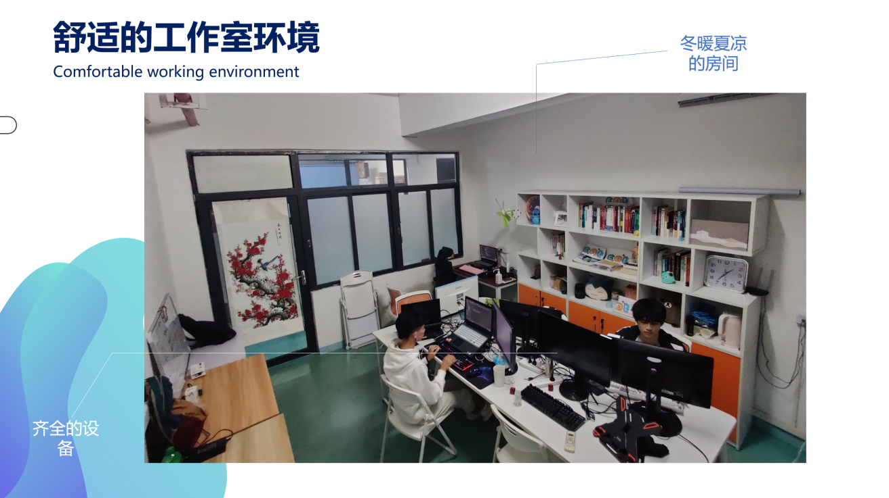
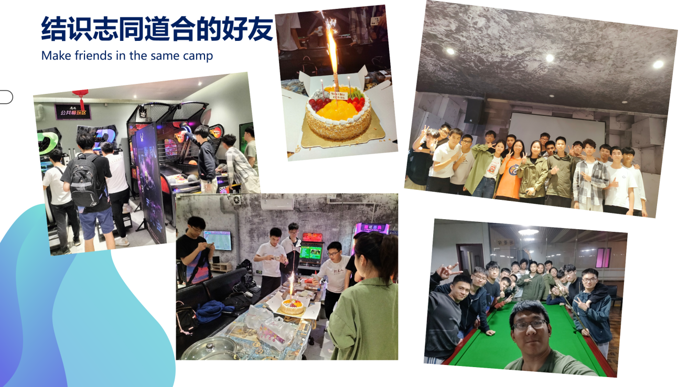
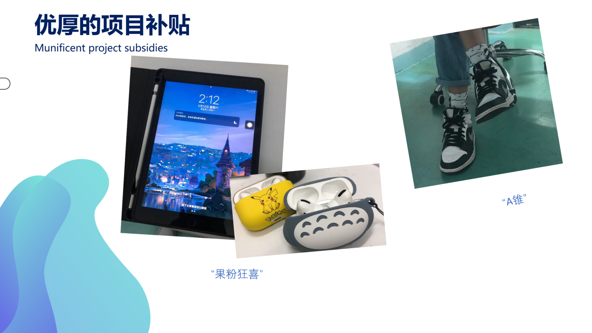
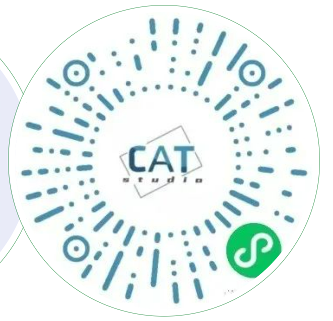

# C.A.T 工作室
## 了解我们
C.A.T工作室，成立于2017年，指导老师为梁祖红老师，分为前端和后台两个小组。
我们把主要精力聚焦校外，致力于**政府及企业级 的大型项目开发**，团队与**玉兰集团**、**<u>南方电网</u>**等公司建立了长期合作关系。近年来研发过**广东省专家匹配系统、智能塑料回收瓶箱（与羊城通合作）、国家海洋局南海分局北斗航标系统以及广州、湛江、清远、汕头等地供电局的智能配电网辅助决策系统**。工作室已与自动化研究生团队达成合作并取得丰厚成果，同时组队参与App、小程序大赛并获得奖项。目前毕业师兄师姐基本就职于 **腾讯、字节跳动、Shopee** 等一线互联网企业。

## 工作室成就
- 智能塑料瓶回收箱
- 上腾科技云平台系统
-  “百货校园行”小程序
- 美丽乡村智慧社区平台
- 广州市供电局运营分析平台
- 清远市输电运维决策支持系统
- 国家海洋局南海分局北斗航标系统
- 广东玉兰集团有限公司B2B订单系统
- 韶关市供电局-基于GIS的可视化规划平台 
- 汕头、湛江的智能配电网辅助决策系统 
- 南方电网——基于GIS的智能配电网自动规划系统
- 南方电网——基于GIS的分布式屋顶光伏装机容量测算系统

## 小组分工
### 前端 (靓女多)
前端即网站前台部分，负责页面设计开发以及业务逻辑的实现，我们平时在浏览器中看到各式各样的页面基本都是出自前端之手，随着大前端的到来，前端现在不仅能开发网页，通过node.js还能完成后台开发。
C.A.T工作室前端组主要基于HTML、CSS、JavaScript等基础前端编程语言进行开发，同时引入处于前沿的前端技术（框架、工具库等）对项目进行进一步的构建、优化。我们致力于打造页面视觉效果更优、用户体验更佳、功能更强大的网站、App、小程序等产品。我们不局限于页面展示,同时也聚焦业务逻辑，做我们“想做、会做、能做”的事。如果你对前端有足够的热爱，对技术有足够的热情，那就请你加入我们吧！

### 后台 (靓仔多)
后台开发，通常也称服务器端开发。主要负责业务逻辑处理，工作中处理前端的请求，进行逻辑处理和数据交互，现阶段的Web端、移动端等都需要后台技术的支持
C.A.T工作室后台组基于Java语言开发，自成立以来，和政府、企业等多有合作，将主要精力聚焦在校外，致力于开发**_智能电网辅助决策系统_**等大型项目。各类大型项目使得我们的技术水平日益精进，在得到成长的同时也得到了**_丰厚的项目补助_**，如果你想要提升自己的编程水平，积累自己的项目经验，同时具备坚实的Java语言基础，对服务器端编程感兴趣，有出色的学习能力以及良好的团队协作能力，那么后台组绝对是你的不二选择。

## 为什么要加入C.A.T

## 招新时间

招新面向大学城校区2023级全体新生，只要对编程有兴趣的同学都可以来参加招新。
招新时间定于**大一下学期**，具体关注公众号，稍后会给大家开设招新咨询群。
**招新信息还可以关注我们的公众号**

## Q&A

### 欢迎零基础的报名参加工作室吗？
答：_**当然是欢迎的啊！**_现在零基础也是没关系哦，我们更看重的是你的学习能力与学习热情，有潜力的人当然也是我们的目标，所以大胆报名吧！希望你能成为我们的中流砥柱。

### 工作室学习的环境氛围如何？
答：就环境来说，工作室在_**创谷拥有专属超大单人工位**_，离教学楼近，方便我们上下课的同时还提供免费空调，网络，专业书籍，师兄师姐的现场指导，实体服务器和公用会议室等，我们还能在做项目的过程中领取相当丰厚的项目补助。
就工作室氛围来说，我们工作室的伙伴普遍亲切博爱，儒雅随和，大家庭的各位成员都愿意带领新伙伴一起学习成长，互帮互助，整体学习氛围比较轻松、欢乐，同时也会定期举办分享会，在自我提升的同时，也促进了其他小伙伴们的进步。

### 工作室学习的环境氛围如何？
答：**大部分师兄都在腾讯字节等互联网大厂工作（“听说”18级师兄师姐全部年薪50w+）**，工作室里能接到政府和企业的项目，也有师兄师姐带着打比赛，无论是对个人成长（竞赛经历）还是对于日后的就业（项目经验）都有不少帮助。

### 工作室的规章制度是怎么样的？
答：_**我们并没有严格的打卡签到制度**_，相对弹性自由，可以由个人来合理规划自己的时间，在技术提升的同时，也能保证学业的进步，但也希望进来的小伙伴能够自律自觉完成学习任务。
